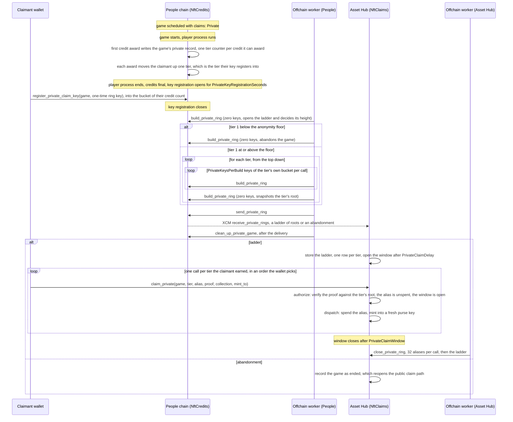

# Private NFT claims

A claim path that breaks the link between the player who earned an NFT claim credit and the account that mints it. A game opts into private claims at scheduling time.

NFT claim credits are committed to Merkle trees, one per award block. On the public path a claim
proves a leaf built from the claimant, so the mint is tied to the player. On the private path a
claim instead proves ring VRF membership of one game's registrants, so the proof does not reveal the
player. A game builds a ladder of nested rings, one per credit a claimant can earn, so a registrant
mints one NFT per credit and no mint names them.

## The path at a glance

## How a private game runs

1. **Schedule.** An operator sets `claims: ClaimPath::Private` on the `GameSchedule` entry. Every
   tree the game's credits form carries the same value, so the claims chain reads the operator's
   choice from the tree. A private game is private only. The schedule names no payout: a
   registrant mints the credits they earned.
2. **Register a key.** Once the game's player process ends and credits are final, key registration
   opens for `PrivateKeyRegistrationSeconds`. Each claimant calls `register_private_claim_key` on
   the People chain, having earned at least one credit in it, and hands over a one-time ring VRF
   key their wallet made for this game. The key goes into the bucket of the claimant's credit
   count, which is the tallest tier they can prove against. The registration is public and has to
   be: the rings are built from the registered keys, so the sets a proof names are public too. A
   registered key discloses none of the aliases a proof of it yields. What a ring hides is which
   mint is whose.
3. **Build the ladder.** Once key registration closes, the offchain worker drives
   `build_private_ring`. Its first step decides the ladder's height. It then pushes the buckets in
   descending order, in bounded chunks, and snapshots the intermediate at each bucket boundary. At
   that point the intermediate holds exactly the tier's ring, so finishing a clone of it yields
   that tier's root while the original carries on. One pass over the keys builds every ring.
4. **Deliver.** The offchain worker submits `send_private_ring` to ship the game's outcome, one
   root per tier, to the claims chain in one XCM message. The claims chain keeps the first outcome
   it receives for a game and fixes the window its claims are taken in.
5. **Claim.** A claimant submits `claim_private` on the claims chain, once per tier they earned,
   inside the game's claim window.
6. **Clean up.** Offchain workers clean up both chains automatically: on the game chain, the
   offchain worker drives `clean_up_private_game` to remove the game's claimant records and its
   key index in bounded steps. It waits for step 4: its last step drops the record the delivery
   reads, so cleaning up first would leave a queue front that can never be sent. On the claims
   chain, once the window is closed, its offchain worker drives `close_private_ring` to remove the
   ladder and its spent aliases.

## Calls

**NftCredits** (`pallets/nft-credits`, People chain)

- `register_private_claim_key(game_index, key)` — open call, made by the claimant. Needs at least
  one credit of the game, once per game, and refuses a key already registered for it.
- `build_private_ring` / `send_private_ring` / `clean_up_private_game` — authorized calls submitted
  by the pallet's offchain worker. Local or in-block source only, so they cannot be submitted
  externally.

**NftClaims** (`pallets/nft-claims`, Asset Hub)

- `claim_private(game_index, tier, alias, proof, collection, mint_to)` — authorized call with no
  signer and no fee. `authorize` verifies the ring proof against `tier`'s root, checks it yields
  the `alias` the call names, that the alias is unspent and that the game's claim window is open;
  the dispatch spends the alias and mints.
- `receive_private_rings` — receives a game's outcome over XCM: a ladder of roots, or an
  abandonment.
- `close_private_ring` — authorized call submitted by the pallet's offchain worker, once the
  game's claim window is closed. Local or in-block source only, as the tree sweep is.
  Removes up to 32 spent aliases per call and the ladder with the last of them, recording the game
  as closed in `PrivateGameEnds`. It only reclaims space: a closed window takes no claim whether
  the ladder is still there or not, so it runs at the lowest priority tier.

A claim carries no signed origin on purpose: the fee payer would be the strongest link a claim
leaks, since two claims from one account are two claims by one member. What bounds the call instead
is the proof, which nobody outside the ring can make, plus the alias as the pool's `provides` tag
and `MaxPrivateClaimsPerBlock` as a per-block cap. A claim past the cap is
`InvalidTransaction::Future` and stays in the pool.

## Tiers and nullifiers

Ring `t` of a game's ladder holds every registrant that earned at least `t` credits, so ring 1
contains ring 2 contains ring 3. A claimant proves membership in rings 1 to their own credit count,
once each, and mints one NFT per proof.

Each proof runs under a context derived from `(game_index, tier)`, so a claimant holds one
distinct, unlinkable alias per tier. `SpentPrivateClaims: (GameIdx, Alias) -> ()` records spent
aliases, which is the whole spend bound: a member has one alias per tier of a game and each mints
once. `tier` is a public call argument that names a context, not a person.

The tiers a claimant proves against narrow them down no further than the highest one does, because
a proof against ring 5 already implies rings 1 to 4. That is what separates a nested ladder from a
graduated payout, which would put each claimant in a ring of their own tier and let an observer
intersect them. A tier states nothing new about earnings either: `AwardedNftClaimCredits` is keyed
by `(game, claimant)`, so who earned what is public whatever the rings do. What a claimant does
choose is how far up the ladder to spend: a higher tier is a smaller crowd, and they can stop where
it gets too small for them.

The proof message binds `collection` and `mint_to`, so an observed proof cannot be replayed into
another purse or spent on another collection's item.

## The claim window

A ladder's claims run in one window. It opens `PrivateClaimDelay` after the ladder arrives and
closes `PrivateClaimWindow` later, both recorded on the ladder when it is stored and both named by
`PrivateRingReceived`. A claim before the window opens is `InvalidTransaction::Future` and waits in
the pool; a claim after it closes is a custom invalidity and is dropped. A redelivery of the same
ladder keeps the window the first one set.

The delay opens every member's claims in the same block, so the wallets that watch the chain
closest are not the ones that claim first. The close bounds the interval a game's claims fall in.
Without one they trail off indefinitely, and a late claim has only the members who had not claimed
yet as its anonymity set, however large the ring is.

The cost is forfeiture. A member who does not claim inside the window mints nothing and the
credits behind their registration are gone: the ladder is the only path a private game's credits
mint on, and abandonment is decided long before the window opens. The reference window is a month
for that reason.

A closed game is recorded in `PrivateGameEnds` and any later outcome for it is a
`PrivateOutcomeConflict`. The aliases that stopped a tier minting twice were dropped with the
ladder, so a second ladder over the same keys would mint every tier of the game again, and an
abandonment would reopen the public path for credits that already minted privately.

## Abandoned games

A game is abandoned when its tier-1 ring stays below its anonymity floor, or when the build fails
`PRIVATE_RING_BUILD_RETRIES` (8) times in a row. A push fails on trusted-setup chunks the ring
cannot be built from, which no retry repairs. Without the limit the game would hold its keys, its
registrations and its credits forever and nothing could claim them.

The floor is `MinPrivateRingKeys`, raised to `MinPrivateRingParticipation` of the claimants that
could register for the tier, and capped at `MaxPrivateRingKeys` so a full registration always
reaches it. It is measured per tier, so a game whose upper tiers are thin still serves its lower
ones: the ladder's height is the tier before the first one that falls short.

Both the ring and the floor shrink as the tier rises, so a tier above one that fell short can clear
its own floor. Such a tier is dropped with the rest: a ladder is the range 1 to its height, which
is what the delivery carries and what a claim indexes into, so it holds no gap. Ring 1 is every
registrant, so a game whose tier 1 falls short has no ring anyone can hide in and is abandoned.
`PrivateRingAbandoned` names both the keys registered and the floor they fell short of.

An absolute floor on its own is a fixed number of keys to buy. A group that registers with keys it
never claims with fills the anonymity set of one target, and sixteen keys in a game of hundreds
buys the whole set. The share ties that cost to the size of the game. Padding a higher tier costs
more still: a key that pads ring `t` has to carry `t` credits, so the smallest sets are the dearest
to fill.

A half-built ladder commits to nothing anyone can prove against: its tiers are delivered together
or not at all, so there is no partial outcome to withdraw. The abandonment is delivered like a
ladder and recorded in `PrivateGameEnds`, which reopens `claim` for the game's credit trees, so
every player mints publicly as they would have without the opt-in. Registrants lose only what the
registration cost.

No credit mints twice. A game is abandoned only when no ladder exists, so no `claim_private` of it
can have been made. The claims chain refuses an abandonment for a game holding a ladder, and a
ladder for one already abandoned (`PrivateOutcomeConflict`).

## Configuration

| Item | Where | Reference value |
|---|---|---|
| `PrivateKeyRegistrationSeconds` | `pallet-nft-credits` | 2 hours — how long key registration stays open |
| `MinPrivateRingKeys` | `pallet-nft-credits` | 16 — absolute floor, below which the game is abandoned |
| `MinPrivateRingParticipation` | `pallet-nft-credits` | 25% — share of a tier's eligible claimants that has to register for it |
| `MaxPrivateRingKeys` | `pallet-nft-credits` | 767 — registrants one game takes |
| `PrivateRingExponent` | both | `R2e10` — ring capacity, 767 keys |
| `PrivateKeysPerBuild` | `pallet-nft-credits` | 8 — keys pushed per offchain-worker call |
| `MaxPrivateRingTiers` | both | 15 — tiers one ladder carries, what a full attendance of the reference game earns. Both chains bound it: the game chain builds no more, the claims chain decodes no more |
| `MaxPrivateClaimsPerBlock` | `pallet-nft-claims` | 8 — ring verifications per block |
| `PrivateClaimDelay` | `pallet-nft-claims` | 5 minutes — from a ladder arriving to its claims opening |
| `PrivateClaimWindow` | `pallet-nft-claims` | 30 days — how long a game's claims are taken |

`PrivateRingExponent` must match on both chains, and the trusted-setup chunks of that exponent must
be in `chunks-manager` before any ring builds. The initial-setup scripts upload `R2e9` and `R2e10`;
a larger exponent takes a chunk set of its own.

## What a registrant receives

Their credit count, capped at the ladder's height. Under the reference runtime `MaxRounds` is 3 and
`MaxGroupSize` is 6, so a full attendance earns `(6 - 1) * 3 = 15` credits and mints 15 NFTs if the
game is large enough for 15 tiers to clear the floor, and fewer otherwise. Each forfeited tier is
one the game could not hide a claimant in.

Registration costs one credit, the ladder's base, so every claimant that earned anything is in
ring 1 and mints at least once. The cost is in credits and not PGAS, because a person claimant has
no account on the People chain to burn PGAS from. One credit is one attestation, so a ring key
costs other participants' attestations, which is what padding an anonymity set has to pay.

A higher tier costs crowd: tier `t` holds only the registrants that earned at least `t`. The
claimant spends up the ladder and stops where the set gets too small for them, a choice the runtime
does not make for them.

A game's tier counters live in its record, one per credit it can award, and each award moves a
claimant up one tier. The counts need no integrity test, being derived from the game's own shape.
The runtime's own bounds are asserted instead. The claims chain holds
`MaxPrivateRingKeys * MaxPrivateRingTiers` to what one claim window serves at
`MaxPrivateClaimsPerBlock` a block, because a claim past a closed window is dropped from the pool
without a word. The bound is loose: a game reaches it only if every registrant earned the most the
ladder pays.

Whether a delivery fits the claims channel is checked before every delivery rather than asserted,
because only chain state knows the channel's `max_message_size`, and a message that does not fit is
retried rather than dropped. The other integrity tests assert that the claim window is at least one
block, that ring construction fits the offchain-worker budget and that a private claim and a
`close_private_ring` step each fit the block's extrinsic budget.

## Privacy limits

- **A game's registration is capped at `MaxPrivateRingKeys`.** Ring 1 holds every registrant, so
  the cap is on the game and not on a tier. Registration is first-come, first-served, and a game
  with more claimants than one ring holds turns the surplus away, leaving them no private path.
  Raising `PrivateRingExponent` is the way to lift that, not splitting a tier over several rings:
  a claim names the ring it proves against, so each would be a smaller set to hide in.
- **A higher tier is a smaller set.** The ladder is nested, so the sets shrink as a claimant climbs
  it. The anonymity floor stops a tier that hides nobody from being built at all. A claimant that
  spends the whole ladder is as anonymous as its top tier makes them; one that stops lower keeps
  the wider set and forfeits the rest.
- **The set is keys, not people.** Registrants who collude, or who register a key they never claim
  with, count towards the anonymity floor without hiding anyone. Duplicate keys are refused, but an
  unused key is indistinguishable from a used one. Registration costs credits the claimant earned
  in that game, and a key that pads tier `t` has to carry `t` of them, so the smallest sets cost
  the most to pad. `MinPrivateRingParticipation` makes the number scale with the game. Neither
  turns keys into people.
- **Timing is a side channel.** The window bounds it but does not close it: a claim in the block
  the window opens, or one made at a fixed interval after registering, narrows the set whatever the
  cryptography does. What a wallet does inside the window is what decides this.
- **`mint_to` reuse is refused, its aftermath is not.** A Scarcity purse key holds one NFT, so a
  second claim into the same key fails and a fresh key per claim is forced. Moving the NFTs out of
  those keys afterwards, or deriving the keys so that an observer can enumerate them, links the
  claims again. The ring's guarantee ends at the mint.
- **The submitting node sees the claim.** A `claim_private` transaction is gossiped from some node,
  which sees the proof next to whatever it knows about its submitter. That link is outside the
  runtime.

## What a wallet has to do

None of these are choices the runtime can make for a claimant: each one is a public call argument
or a submission time that only the claimant controls.

- **Pick a moment inside the window at random.** The window exists so that a game's claims cover
  each other, which they do only if they are spread over it. Claiming as soon as it opens, or a
  fixed interval after registering, gives the timing away.
- **Randomise the order the tiers are spent in.** `tier` is public. A claimant who walks 1, 2, 3 at
  their own pace leaves a pattern that ties their own claims together, even though the aliases
  behind them are unlinkable by construction.
- **Decide how far up the ladder to spend.** Every tier above the first is a smaller set. A
  claimant who wants the widest crowd claims tier 1 alone and forfeits the rest. One who wants
  every NFT accepts the top tier's set for the claim that names it.
- **Mint each claim into a fresh purse key.** The chain refuses a key that holds an NFT already, so
  a new key per claim is forced, but the keys also have to be underivable from one another and left
  alone afterwards.
- **Vary nothing else that is public.** `collection` is a call argument: minting every tier into
  one niche collection links those claims as surely as a shared purse key would.
- **Claim before the window closes.** A missed window mints nothing and the credits behind the
  registration are not returned.
