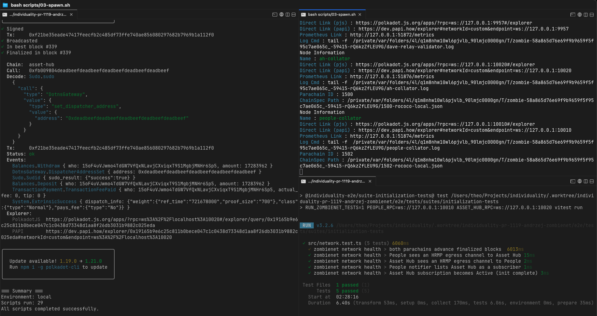

# zombienet — local network harness

The runnable **harness** that brings up a realistic local network of this repo's runtimes —
**Relay + People (1502) + Asset Hub (1500)**, no Bulletin — with zombienet, initialises it via the
shared `scripts/initial-setup` bash suite (the same flow used for real environments), and
snapshots/restores its state.

This is **infrastructure, not a test suite** — not a pnpm package; run its shell scripts directly,
or use the optional `../justfile` wrapper if you prefer. The tests that validate the initialised network live in `../suites/initialization-tests`. It
spawns real node binaries, so it is **local/manual**, not part of standard CI. Foundation for manual
testing, init-state tests, and (future) the OCW tx-banning suite.

## Prerequisites

- `rustup` with the repo's pinned toolchain (`rust-toolchain.toml`) — used to build the
  runtimes and, on macOS, the node binaries.
- `pnpm` (via corepack) and Node (see `../.nvmrc`).
- `dot` (polkadot-cli), `jq`, `bc` — installed/checked by `scripts/initial-setup/00-requirements.sh`.
- The **node binaries** are installed by `bash scripts/00-install-binaries.sh` into `.tools/bin`
  (gitignored)
  via the vendored `scripts/get_polkadot_binaries.sh`:
  - the `polkadot` relay bundle + `polkadot-omni-node` are **built from source** at the polkadot-sdk
    release tag in `.github/env` (`POLKADOT_RELEASE_VERSION`+`POLKADOT_RELEASE_PATCH`). Built rather
    than downloaded because the `rococo-local`/`westend-local` relay chains need the runtime's
    `fast_runtime_binary` wasm that prebuilt release binaries omit — the script builds polkadot
    `--features fast-runtime`. First run clones polkadot-sdk + compiles (~30–60 min); a per-ref cache
    under `.tools/cache` makes re-runs instant. **macOS needs LLVM/libclang** (`brew install llvm`;
    the script auto-detects `LIBCLANG_PATH`).
  - `zombie-cli` is **downloaded + sha256-verified** at `ZOMBIENET_SDK_VERSION` (pinned in `.github/env`).

## Run it

**Two independent inputs feed the network — don't confuse them:**

- **`build-runtimes`** (cargo) produces the People + Asset Hub **WASM**. It feeds BOTH descriptor
  generation AND chain-spec generation.
- **`install-binaries`** installs the pinned **node binaries** (`polkadot` bundle + `polkadot-omni-node`
  + `zombie-cli`). It feeds `gen-specs` (whose `chain-spec-builder` ships in omni-node) and `spawn`.
  It is **not** needed to derive descriptors.

Ports match `scripts/initial-setup/config-local.env`: relay `:10000`, People `:10010`, AH `:10020`.

### Verified local runbook

The sequence below was run successfully on this branch with the direct shell scripts. The init-state suite passed, then the network was torn down and
the RPC ports were confirmed closed.

First-time prerequisites:

```bash
# JS workspace dependencies for e2e
cd e2e
pnpm install --frozen-lockfile

# bootstrap scripts require `dot` from polkadot-cli
npm install -g polkadot-cli@1.19.0
```

Build the network inputs:

```bash
cd e2e/zombienet
bash scripts/00-install-binaries.sh
bash scripts/01-build-runtimes.sh
bash scripts/02-gen-specs.sh

cd ..
pnpm run descriptors:update
```

Then use three terminals, but do **not** run terminal C until terminal B has finished successfully
**and** the readiness probe below shows that People already lists Asset Hub as subscriber `1500` and
Asset Hub already reports `Active`. `04-bootstrap.sh` takes minutes and the long pole is usually
`07-add-zk-chunks.sh`.

If you start the init-state suite too early, the first HRMP checks can pass while the final
subscriber/`Active` checks still time out because bootstrap has not yet reached
`10-subscribe-ah-ring-root-updates.sh`.

```bash
# Terminal A — keep running
cd e2e/zombienet
bash scripts/03-spawn.sh
```

```bash
# Terminal B — one-time bootstrap for a fresh spawn
cd e2e/zombienet
bash scripts/04-bootstrap.sh
```

Readiness check before terminal C:

```bash
cd e2e
pnpm tsx -e 'import { connectPeople, connectAssetHub, ASSET_HUB_PARA_ID } from "@individuality-e2e/shared"; const people = connectPeople(); const ah = connectAssetHub(); const run = async () => { const [pSub, aStatus] = await Promise.all([people.api.query.MembersNotifier.Subscribers.getValue(ASSET_HUB_PARA_ID), ah.api.query.MembersSubscriber.Subscription.getValue()]); console.log(JSON.stringify({ subscribersParaId: pSub ? ASSET_HUB_PARA_ID : null, subscription: aStatus?.type ?? null }, null, 2)); await new Promise(r => setTimeout(r, 50)); people.client.destroy(); ah.client.destroy(); }; run();'
```

Only run the suite once that command prints:

```json
{
  "subscribersParaId": 1500,
  "subscription": "Active"
}
```

In the successful local run used to verify this README, the time from starting `bash
scripts/03-spawn.sh` to starting `pnpm --filter @individuality-e2e/suite-initialization-tests run
test` was about **43m36s** on a **MacBook Pro M4**. Treat that as a machine-specific data point, not
as a guarantee; the readiness probe above is the source of truth.

```bash
# Terminal C — only after terminal B exits successfully and the readiness check matches
cd e2e
pnpm --filter @individuality-e2e/suite-initialization-tests run test
```

If the readiness probe still prints `null` / `Inactive`, do not run the suite yet.

Expected result:



- Vitest reports `5/5` passing in `suites/initialization-tests`.
- The suite checks finalized-block progress, HRMP connectivity in both directions, People notifier
  subscription state, and Asset Hub `MembersSubscriber.Subscription = Active`.

Clean teardown:

```bash
# easiest: Ctrl-C terminal B, then Ctrl-C terminal A
```

Or from another shell:

```bash
pkill -INT -f 'scripts/initial-setup/start.sh local'
pkill -INT -f 'zombie-cli'
```

Verify the network is down:

```bash
lsof -nP -iTCP:10000 -iTCP:10010 -iTCP:10020 -sTCP:LISTEN
```

No output means the relay, People, and Asset Hub RPC ports are no longer listening.

Order/why: `build-runtimes` precedes both `pnpm run descriptors:update` (from `..`) and
`gen-specs`; `install-binaries` precedes `gen-specs` + `spawn`. The harness still lives in this
subdirectory, but the tests now share the same `e2e/` root: build the runtimes here, then generate
descriptors and run tests from `..`.

If you prefer wrappers, `../justfile` mirrors the same script-first flow, but the direct commands
above are the primary runbook.

> Only the descriptors `package.json` is committed; `pnpm run descriptors:update` (re)builds its
> `src`/`dist` with the local `papi` (so `pnpm install` in `..` must precede it). Re-run
> `bash scripts/01-build-runtimes.sh` + `pnpm run descriptors:update` after any runtime change so
> the typed APIs match the spawned chain.

## Fast boot: snapshot the initialised state

`bootstrap` (dominated by the ZK chunk upload) takes minutes. Capture the post-init
state **once** and re-spawn from it in seconds — no bootstrap:

```bash
# With a freshly spawned + bootstrapped network running:
bash scripts/05-snapshot.sh
# later (specs + binaries unchanged):
bash scripts/06-spawn-from-snapshot.sh
```

How it works / what to know:

- **Whole-network capture (all 6 nodes, one stop point).** `snapshot` tars each node's `data/` — 4
  relay validators + both collators. You **can't** snapshot just People: a parachain DB is tied to
  its relay's block history, and the People↔AH HRMP channels live in *relay* state (opened at
  runtime by `01b`), so the relay must be captured too. The collators' embedded relay full-node
  (`relay-data/`, sibling of `data/`) is intentionally **not** captured — it re-syncs in seconds
  from the restored relay validators (which it can only do because the pinned relay spec below gives
  it the same genesis), and we only snapshot each node's `data/`.
- **Captured relay spec.** `snapshot` also writes `.tools/snapshot/rococo-local.raw.json`. The relay's
  fast-runtime WASM is not byte-identical across build hosts (verified: a CI Linux build and a local
  macOS build differ), so its genesis only matches on the host that built the snapshot. It's pinned via
  the relay `chain_spec_path` in `network-snap.toml`; without that, a snapshot restored elsewhere boots
  the collators' relay nodes on a mismatched genesis and the relay never leaves #0. Same-host respawn is fine.
- **Local-path `db_snapshot` + pinned relay spec.** `spawn-snap` uses the committed
  `network-snap.toml` — a copy of `network.toml` with `db_snapshot = "./.tools/snapshot/<node>.tgz"`
  lines added per node and a relay `chain_spec_path = "./.tools/snapshot/rococo-local.raw.json"`.
  The relative paths resolve against the spawn CWD (`e2e/zombienet/`).
- **Spec/version-locked.** A snapshot is valid **only** while `specs/*.json` and the node binaries
  are unchanged — the restored parachain DB's genesis hash must match the freshly-generated
  parachain spec, or the node rejects it as the wrong chain. The relay side is instead locked by the
  captured relay spec (shipped with the snapshot). `manifest.txt` records the spec sha256s. Re-run
  `snapshot` after any runtime / spec / binary change.
- **Warm restart.** Chains resume at the captured height; give the collators a few blocks to resume
  authoring against the restored relay. No bootstrap rerun is needed, and the snapshot is only
  captured after the init-state suite has already passed. Snapshots (~1.2 GB) live under the
  gitignored `.tools/` and are **not** committed.

### Download a prebuilt snapshot (CI)

`.github/workflows/zombienet-snapshot.yml` runs nightly (and on `workflow_dispatch`): it spawns +
bootstraps the network and publishes the captured state as a **rolling GitHub prerelease** (tag
`e2e-zombienet-snapshot`). To boot from that instead of capturing your own:

```bash
# in e2e/zombienet (the harness):
bash scripts/00-install-binaries.sh   # node binaries (still needed locally)
bash scripts/01-build-runtimes.sh
bash scripts/02-gen-specs.sh          # specs MUST match the snapshot's runtime
bash scripts/07-fetch-snapshot.sh     # gh release download -> .tools/snapshot/
bash scripts/06-spawn-from-snapshot.sh
```

`fetch-snapshot` needs the GitHub CLI (`gh auth login`). It verifies `SHA256SUMS` and compares the
published `specs_sha256` (in `manifest.json`) against your local `specs/*.json`, warning on drift —
a mismatch means your runtime differs from the snapshot's commit and `spawn-snap` would be rejected
(check out that commit, or regenerate locally). Override the source via `SNAPSHOT_REPO` / `SNAPSHOT_TAG`.
The snapshot only replaces the *bootstrap*; you still build the runtimes + node binaries yourself.

## What the init-state test checks (`../suites/initialization-tests/src/network.test.ts`, gated by `RUN_ZOMBIENET_TESTS=1`)

1. Both parachains advance finalized blocks.
2. People sees an HRMP egress channel to Asset Hub (`ParachainSystem.RelevantMessagingState`).
3. Asset Hub sees an HRMP egress channel to People.
4. People notifier lists AH as a subscriber (`MembersNotifier.Subscribers(1500)`).
5. AH subscription becomes `Active` (`MembersSubscriber.Subscription`) — init complete. This is async
   and polled with a long timeout.

## Gotchas

- **Bootstrap is once-per-spawn.** `scripts/initial-setup/start.sh` is all-or-nothing
  (`set -euo pipefail`) and not fully idempotent; re-running on an already-initialised chain may
  fail a guard. Re-spawn for a clean run.
- **No Bulletin.** The only Bulletin-touching step (`01c`) runs as a harmless no-op (it submits a
  People sudo→XCM; the relay-side open to the unregistered para 1501 fails/dangles asynchronously
  and does not affect People↔AH). Nothing else references Bulletin.
- **HRMP before subscribe.** `start.sh` opens HRMP (`01b`) before subscribing AH (`10`), which is the
  required order. If init (#5) ever wedges (AH stuck `Inactive`), restart the People collator to clear
  the tx-pool ban, then re-spawn + re-bootstrap.
- **After a runtime change**, re-run `bash scripts/01-build-runtimes.sh` (here) +
  `pnpm run descriptors:update` (in `..`) so the typed APIs match the spawned chain.

## Troubleshooting

Findings from bringing this up on macOS — the relay binary was the hard part. Symptom → cause → fix:

- **`<chain> development wasm not available`** at spawn (e.g. `Rococo development wasm not available`):
  the relay binary lacks the runtime's `fast_runtime_binary` wasm that `rococo-local`/`westend-local`
  require (`polkadot/node/service/src/chain_spec.rs`: `*_local_testnet_config`). **Prebuilt release
  binaries omit it** — which is why `scripts/get_polkadot_binaries.sh` builds polkadot from source with
  `--features fast-runtime`. If you hit this, `.tools/bin/polkadot` is a stale/downloaded binary: remove
  `.tools/` and re-run `bash scripts/00-install-binaries.sh`.
- **`Library not loaded: @rpath/libclang.dylib`** (librocksdb-sys): macOS has no libclang on the loader
  path. `brew install llvm`; the script auto-detects and exports `LIBCLANG_PATH`.
- **`failed to select a version for ... core2 ... is yanked`**: a fresh resolve hits yanked deps. Always
  use `--locked` (the script does) so each crate's published `Cargo.lock` is used.
- **`Failed to resolve entry for package "@polkadot-api/descriptors"`** (vitest/tsc): descriptors not
  generated yet, or referenced via `file:` (pnpm injects a *stale packed copy* because the package has a
  `polkadot-api` peer dep). Fix: it's a `workspace:*` member — run `pnpm install` then
  `pnpm run descriptors:update`.
- **AH `Subscription` stuck `Inactive`** (test #5): the People→AH init XCM didn't complete — usually
  subscribe ran before HRMP was visible. Restart the People collator (clears the tx-pool ban), then
  re-spawn + re-bootstrap.
